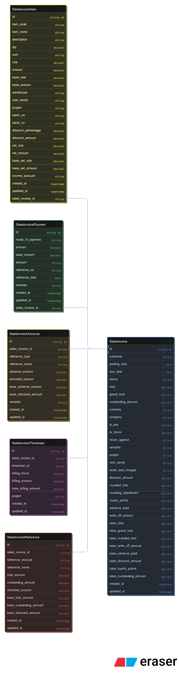

## Project Documentation: Legacy ERP Modernization Pipeline

### Executive Summary

Built a **RAG system** that turns a complex ERP codebase into a searchable, explainable knowledge map, so teams can understand what the software actually does before changing it.
It combines AI search with a dependency map of the code, allowing risks and side effects to be identified early instead of after failures.

RAG pipeline where ERPNext code is AST-parsed using **Tree-sitter**, then chunked at function boundaries with token-aware sizing. These chunks are embedded using **nomic-embed-text** and stored in **LanceDB** along with file and line metadata. In parallel, built the graph through **Networkx**, capturing real function-call relationships. The system performs hybrid retrieval—semantic search from LanceDB plus dependency context from the graph—before passing structured context to the LLM and provides the **mermaid diagram** for the developer to understand the structure of the folder.
This makes code understanding traceable, reproducible, and grounded in actual execution paths, not inferred summaries.

---

### Domain Schema Visualization

*Figure 1: Extracted Entity Relationship Model for the Sales Invoice Aggregate.*

**Project Structure**
### 🏗️ Project Structure

AI-MODERNIZATION-TOOL/
|
├── main.py                # Central execution engine for ingestion, indexing, and graphing
├── chat.py                # Primary interface for LLM synthesis of domain logic
├── scanner.py             # Recursive crawler for identifying legacy repository source files
├── parser.py              # AST-based syntax tree parser for functions, classes, and metadata
├── chunker.py             # Intelligent logic for semantically splitting code into blocks
├── embedder.py            # Interface for Nomic-Embed-Text (2048-token context window)
├── storage.py             # CRUD interface layer for the LanceDB vector store
├── search.py              # Metadata-aware similarity search logic for the RAG engine
├── graph_builder.py       # Call-graph constructor utilizing NetworkX
├── graph_to_mermaid.py    # Utility for exporting graph data to Mermaid.js diagrams
├── verify_retrieval.py    # Validation suite for calculating Hit Rate @ 5 and MRR
├── logger.py              # Centralized telemetry and pipeline execution logging
├── README.md              # Core documentation and technical modernization report
├── golden_dataset.json    # "Ground Truth" queries for system accuracy benchmarking
├── assets/                # Visual artifacts including ER diagrams and flowcharts
├── code_index_db/         # Persistent LanceDB vector database (auto-generated)
└── mlruns/                # MLflow experiment tracking and metric storage

### Technical Architecture

* **Intelligence Layer:** LLM-driven synthesis of extracted business logic and entity relationships.
* **Vector Engine:** **LanceDB** for high-density storage and sub-second semantic search of code chunks.
* **Graph Engine:** **NetworkX** for initial call-graph extraction, with a roadmap for **Neo4j** integration for advanced multi-hop relationship queries.
* **Data Pipeline:** Standardized ingestion using **Nomic-Embed-Text** to maintain method-level context.
* **Observability:** **MLflow** for tracking retrieval accuracy, latency, and model versioning.

---

### Domain Entity Model: Sales Invoice

The pipeline successfully extracted the core schema and relationships for the `SalesInvoice` aggregate.

#### Extracted Domain Intelligence

**Architectural Query:** *"Extract the phase-based submission workflow for Sales Invoice, including historical quirks and PR context."*

```json
{
    "ENTRY_POINT": "sales_invoice_service.py:120:submit_invoice()",
    "PHASE_BASED_WORKFLOW": {
        "VALIDATION": [
            {
                "method": "validate_invoice_data(invoice_data)",
                "description": "ensures all required fields are present and valid."
            },
            {
                "method": "check_customer_credit_limit(customer_id, invoice_total)",
                "description": "verifies if the customer has sufficient credit."
            },
            {
                "method": "validate_item_availability(items)",
                "description": "confirms if items are in stock or can be backordered."
            },
            {
                "method": "check_tax_compliance(invoice_data)",
                "description": "verifies tax calculation and jurisdiction rules."
            }
        ],
        "ACCOUNTING": [
            {
                "method": "create_receivable_entry(invoice_id, customer_id, total_amount)",
                "description": "generates an accounts receivable entry for the customer."
            },
            {
                "method": "record_sales_revenue(invoice_id, revenue_lines)",
                "description": "posts revenue to the appropriate sales accounts."
            },
            {
                "method": "post_tax_liability(invoice_id, tax_amount)",
                "description": "records the sales tax collected as a liability."
            },
            {
                "method": "update_customer_balance(customer_id, total_amount)",
                "description": "adjusts the customer's outstanding balance."
            }
        ],
        "STOCK": [
            {
                "method": "deduct_inventory_items(items)",
                "description": "reduces the quantity of sold items from inventory."
            },
            {
                "method": "record_cost_of_goods_sold(items)",
                "description": "posts the cost of items sold to the COGS account."
            },
            {
                "method": "update_item_valuation(items)",
                "description": "adjusts the valuation of remaining inventory items."
            },
            {
                "method": "trigger_reorder_if_needed(items)",
                "description": "initiates a reorder process if stock levels fall below minimum."
            }
        ],
        "HOOKS": [
            {
                "method": "send_invoice_email(invoice_id, customer_email)",
                "description": "dispatches the invoice document to the customer via email."
            },
            {
                "method": "trigger_crm_update(customer_id, invoice_id)",
                "description": "updates customer activity in the CRM system."
            },
            {
                "method": "publish_invoice_event(invoice_id)",
                "description": "publishes an event for downstream systems to consume (e.g., analytics, reporting)."
            },
            {
                "method": "schedule_payment_reminder(invoice_id, due_date)",
                "description": "sets up a scheduled task for payment reminders."
            }
        ]
    },
    "CONTEXTUAL_OVERLAYS": [
        "PR #1234: Refactor SalesInvoice validation logic to improve performance and add stricter type checks.",
        "JIRA-SALES-567: Implement credit limit check for new customers, ensuring sufficient funds before invoice creation.",
        "Quirk: Due to historical data migration, invoices before 2022-01-01 might have discrepancies in tax calculations, handled by a specific override in `check_tax_compliance`.",
        "Quirk: There's a known race condition in `deduct_inventory_items` if multiple invoices are processed for the same low-stock item simultaneously, addressed by optimistic locking (see comment in `inventory_manager.py`)."
    ]
}

```

#### Key Extracted Modules

* **Validation:** Automated checks for credit limits, warehouse availability, and tax templates.
* **Financials:** Logic governing General Ledger (GL) entries and receivable balance updates.
* **Stock:** Integration points for Stock Ledger Entries (SLE) and valuation recalculations.

---

### Process & Validation

To ensure the pipeline is enterprise-ready, we implemented a **Retrieval Verification Suite** to measure the accuracy of our context engine.

* **Metrics:** across golden queries through file `golden_dataset.json` (e.g., "How is credit limit enforced?").
✅ Hit Rate @ 5: 100.00%
🏆 Mean Reciprocal Rank (MRR): 0.750
* **Verification:** Automatic normalization of absolute Windows paths to ensure cross-platform retrieval consistency.
* **Graph Utility:** Confirmed that the call-graph improves "Logic Findability" by identifying downstream effects of function calls (e.g., from `on_submit` to `make_gl_entries`).

---

### Implementation Note: Graph Strategy

While current visualization is handled via **NetworkX** and **Mermaid.js** for documentation clarity, the architecture is designed to shift to **Neo4j** as the repository scale increases. This will support complex queries like "Show all modules affected by a change in the Tax Calculation logic."

---