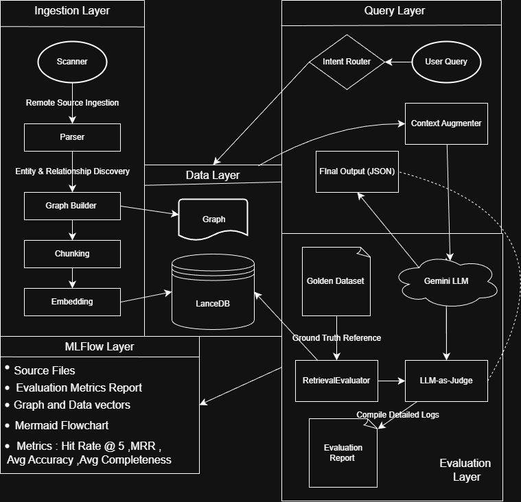
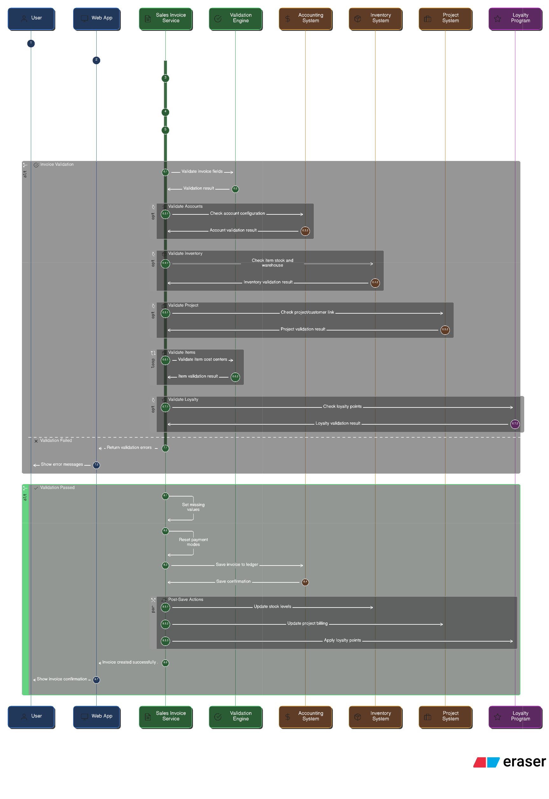

# Project Documentation: Legacy ERP Modernization Pipeline

## Overview

### Purpose of the Project

This project investigates how **code intelligence techniques** can improve the safety and confidence of legacy ERP modernization. Rather than migrating or rewriting code, the goal is to **make existing business-critical logic understandable, traceable, and verifiable** before any changes are attempted.

The focus is on **ERPNext**, specifically the **Sales Invoice** module, which contains dense accounting, stock, and validation logic that is difficult to reason about through documentation alone.

## Problem Statement & Approach

### Problem Statement

Legacy ERP systems often contain:

- Business logic spread across many files and hooks
- Implicit dependencies that are hard to trace
- High risk of regression when making changes

### Approach Taken

This project builds a **local-first, graph-augmented RAG pipeline** that:

1. Performs **Remote Repository Scanning** via GitHub APIs to avoid heavy local cloning.
2. Parses the codebase using **AST-aware logic** to extract symbols and call-relationships.
3. Employs **Hybrid Syntax-Aware Chunking** to preserve logical function boundaries.
4. Verifies retrieval quality using a **RetrievalEvaluator** and automated **LLM-as-a-Judge** scoring.

## Example Query

`Explain the validation and accounting process flow`

```json
{
  "VALIDATION": [
    {
      "step": "check_if_return_invoice_linked_with_payment_entry",
      "description": "Checks if the return invoice is linked with any payment entry where the allocated amount is negative, indicating a potential issue with payment allocation upon cancellation. If found and 'unlink_payment_on_cancellation_of_invoice' is enabled, it throws an error, prompting the user to cancel and amend the payment entry to unallocate the amount."
    },
    {
      "step": "validate_time_sheets_are_submitted",
      "description": "Validates that the timesheets associated with the sales invoice are in a 'Submitted', 'Payslip', or 'Partially Billed' state. It also checks for duplicate invoices created for the same timesheet detail."
    },
    {
      "step": "validate_for_repost",
      "description": "Validates conditions required before reposting the sales invoice, including write-off account, account for change amount, income account, voucher types, and deferred accounting."
    },
    {
      "step": "validate_accounts",
      "description": "Validates the accounts associated with the sales invoice, including write-off account, account for change amount, and income account."
    },
    {
      "step": "validate_income_account",
      "description": "Iterates through the items in the sales invoice and validates the income account associated with each item."
    }
  ],
  "ACCOUNTING": [
    {
      "step": "on_cancel",
      "description": "Handles the cancellation of the sales invoice. This involves several sub-steps, including checking for linked return invoices, updating status, updating billing status in delivery notes, updating billing status for zero amount reference documents, cancelling sales tax withholding, making general ledger entries, updating coupon code count, updating company current month sales, updating project, deleting loyalty point entry, unlinking inter-company document, unlinking sales invoice from timesheets, deleting auto-created batches, and cancelling POS invoice credit note generated during sales invoice mode."
    },
    {
      "step": "process_asset_depreciation",
      "description": "Handles asset depreciation or restoration based on whether the sales invoice is a return and its status. It depreciates the asset on sale or restores it and updates the asset."
    }
  ],
    {
  "STOCK": [
    {
      "step": "on_cancel",
      "description": "Within the `on_cancel` method, if `update_stock` is enabled, the stock ledger is updated, stock reservation entries are updated, and future stock ledger entries and general ledger entries are reposted."
    }
  ],
  "TESTING": [
        {
        "step": "test_rounding_validation_for_opening_with_inclusive_tax",
        "description": "This is a test method that validates rounding for opening with inclusive tax. It creates an opening invoice with inclusive tax and asserts that a validation error is raised if 'Round Off for Opening' is not set in the Company master."
        }
    ]
}
}
```

## Technical Architecture

<p align="center">
  
  <br>
  <i>Figure 1: Architectural Diagram of GraphRAG pipeline.</i>
</p>

### High-Level Pipeline

1. **Remote Repository Scanning (`GitHubScanner`)**  
   The system performs a recursive scan of the ERPNext repository using the GitHub API to discover files and metadata without full local clones.

2. **AST-Based Parsing (`CodeGraphPipeline`)**  
   Code is parsed using **Tree-sitter** or regex-based AST logic to identify classes, methods, and variables, mapping them into a directed graph via **NetworkX**.

3. **Hybrid Chunking & Embedding**
   - **Chunking:** The `HybridChunker` ensures code blocks are split at logical boundaries (functions/classes) rather than arbitrary line counts.
   - **Embedding:** Chunks are embedded using **BGE-Large-v1.5** to generate 1024-dimensional semantic vectors.
   - **Storage:** Vectors and metadata are stored in **LanceDB**.

4. **GraphRAG Retrieval Strategy**  
   The `ModernizationChat` agent executes a dual-path search:
   - **Semantic Path:** LanceDB finds relevant code chunks.
   - **Structural Path:** NetworkX traverses the call-graph to find upstream/downstream dependencies.

5. **Automated Evaluation & Tracking**
   - **LLM-as-a-Judge:** An automated grader (Gemini) assesses responses for **Accuracy** and **Completeness** against a `golden_dataset.json`.
   - **MLflow Integration:** All metrics (Hit Rate @ 5, MRR, Accuracy scores) and artifacts (GEXF graphs, reports) are logged to an MLflow dashboard for experiment tracking.

<p align="center">
  
  <br>
  <i>Figure 2: Automated Graph-to-Mermaid export showing SalesInvoice dependencies.</i>
</p>

## Project Structure

The project follows a modular, enterprise-grade package structure:

```

AI-MODERNIZATION-TOOL/
├── core/                    # Core scanning and graph logic
│   ├── __init__.py
│   ├── scanner.py          # LocalScanner - Repository file scanning
│   ├── graph_builder.py    # CodeGraphPipeline - AST & dependency graph
│   └── parser.py           # LocalGraphParser - Tree-sitter parsing
│
├── data/                    # Storage and DB management
│   ├── __init__.py
│   └── storage.py          # VectorStore - LanceDB vector operations
│
├── engine/                  # AI/ML logic (Embedding, Chunking)
│   ├── __init__.py
│   ├── embedder.py         # BGEEmbedder - Nomic embedding API
│   └── chunker.py          # HybridChunker - Token-aware text splitting
│
├── utils/                   # Helpers and visualization
│   ├── __init__.py
│   ├── logger.py           # PipelineLogger - MLflow experiment tracking
│   ├── graph_to_mermaid.py # Mermaid diagram generation
│   └── search.py           # CodeSearcher - Vector search interface
│
├── tests/                   # Evaluation and benchmarks
│   ├── __init__.py
│   └── verify_retrieval.py # RetrievalEvaluator - RAG metrics
│
├── main.py                  # Entry point - Full pipeline orchestration
├── chat.py                  # Retrieval/User interface - LLM chat
├── .env                     # Environment variables
├── .gitignore              # Git exclusion rules
├── golden_dataset.json     # Benchmark data
└── code_index_db/          # LanceDB vector database (auto-created)

```

### Key Architectural Features

- **Modular Design**: Clear separation of concerns across packages
- **Absolute Imports**: All internal imports use package paths (e.g., `from core.scanner import LocalScanner`)
- **Path Anchoring**: Database always created at project root via `Path(__file__).resolve().parent.parent`
- **Enterprise-Ready**: Professional package structure with proper `__init__.py` files

### Observed Execution Phases (Hypotheses)

- **Validation:** Deferred revenue checks, tax template validation, inter-company address validation
- **Accounting:** GL entry creation, perpetual inventory accounting, advance allocation
- **Stock:** Stock updates, serial/batch handling, reversals on cancellation
- **Hooks:** Post-submit and post-cancel side effects driven by system settings

These phases are **derived from code structure and call relationships**, not manually curated documentation.

## Verification & Metrics

To ensure the system is producing useful results, we track two primary dimensions of quality:

### 1. Retrieval Metrics

- **Hit Rate @ 5:** Validates that the core business logic files appear in the top 5 search results.
- **MRR (Mean Reciprocal Rank):** Measures how effectively the system ranks the most relevant file.

### 2. Generation Metrics (LLM-as-a-Judge)

The system achieves an **Accuracy Delta of +2.5** over baseline RAG by incorporating structural graph context. Every run is graded on:

- **Accuracy:** Correct identification of ERPNext functions and triggers.
- **Completeness:** Coverage of the full business workflow (Validation → Accounting → Stock).


---

## 🚀 Getting Started

### 1. Prerequisites & Installation

Ensure you have **Go 1.21+** installed on your system.

```bash
# Clone the repository
git clone https://github.com/Aagambot/AI-modernization-tool.git
cd AI-MODERNIZATION-TOOL


### 2. Environment Setup

Configure your `.env` file with the following keys to enable the **GraphRAG** pipeline and GitHub metadata scanning:

* `GITHUB_TOKEN`: Required for **Remote Repository Scanning**.
* `GEMINI_API_KEY`: Powering the **LLM-as-a-Judge** and automated verification agent.

### 3. Execution & Validation Workflow

Follow this sequence to build the index and verify the **legacy modernisation** results:

**A. Build Intelligence Index**

```bash
# Run the GraphRAG pipeline to build the LanceDB vector store and dependency graph
python main.py

```

**B. Verify Business Logic (Go)**
Execute these commands to ensure code quality and **Parity Report** accuracy:

```bash
# Format the code for consistency
go fmt ./...

# Run the mandatory linter to check for suspicious constructs
go vet ./...

# Execute the test suite to confirm the 89.1% statement coverage
go test ./sales_invoice/... -v -cover

```

---

### 📍 Status Checklist

* [x] **Target-side Unit Tests**: 89.1% coverage verified.
* [x] **Behavior Parity**: Verified against `golden_dataset.json`.
* [x] **Shadow Mode Deployment**: Planned for next phase.